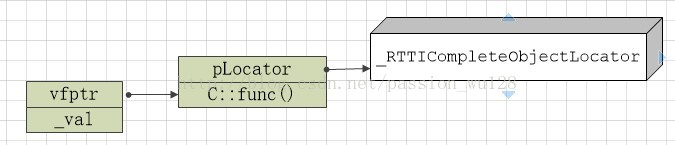

## C++强制类型转换运算符（static_cast、reinterpret_cast、const_cast和dynamic_cast）

http://c.biancheng.net/view/410.html

将类型名作为强制类型转换运算符的做法是C语言的老式做法，[C++](http://c.biancheng.net/cplus/) 为保持兼容而予以保留。

C++ 引入了四种功能不同的强制类型转换运算符以进行强制类型转换：static_cast、reinterpret_cast、const_cast 和 dynamic_cast。

强制类型转换**是有一定风险的**，有的转换并不一定安全，如把整型数值转换成[指针](http://c.biancheng.net/c/80/)，把基类指针转换成派生类指针，把一种函数指针转换成另一种函数指针，把常量指针转换成非常量指针等。C++ 引入新的强制类型转换机制，主要是为了克服C语言强制类型转换的以下三个缺点。

- 没有从形式上体现转换功能和风险的不同。

例如，将 int 强制转换成 double 是没有风险的，而将常量指针转换成非常量指针，将基类指针转换成派生类指针都是高风险的，而且后两者带来的风险不同（即可能引发不同种类的错误），C语言的强制类型转换形式对这些不同并不加以区分。

- 将多态基类指针转换成派生类指针时不检查安全性，即无法判断转换后的指针是否确实指向一个派生类对象。

- 难以在程序中寻找到底什么地方进行了强制类型转换。

强制类型转换是引发程序运行时错误的一个原因，因此在程序出错时，可能就会想到是不是有哪些强制类型转换出了问题。

如果采用C语言的老式做法，要在程序中找出所有进行了强制类型转换的地方，显然是很麻烦的，因为这些转换没有统一的格式。

而用 C++ 的方式，则只需要查找`_cast`字符串就可以了。甚至可以根据错误的类型，有针对性地专门查找某一种强制类型转换。例如，怀疑一个错误可能是由于使用了 reinterpret_cast 导致的，就可以只查找`reinterpret_cast`字符串。

###### C++ 强制类型转换运算符的用法如下：

```
强制类型转换运算符 <要转换到的类型> (待转换的表达式)
```

例如：

```c++
double d = static_cast <double> (3*5); //将 3*5 的值转换成实数
```

下面分别介绍四种强制类型转换运算符。

### static_cast

static_cast 用于进行**比较“自然”和低风险的转换**，如整型和浮点型、字符型之间的互相转换。另外，如果对象所属的类重载了强制类型转换运算符 T（如 T 是 int、int* 或其他类型名），则 static_cast 也能用来进行对象到 T 类型的转换。

static_cast 不能用于在不同类型的指针之间互相转换，也不能用于整型和指针之间的互相转换，当然也不能用于不同类型的引用之间的转换。因为这些属于风险比较高的转换。

static_cast 用法示例如下：

```c++
#include <iostream>
using namespace std;
class A
{
public:
    operator int() { return 1; }
    operator char*() { return NULL; }
};
int main()
{
    A a;
    int n;
    char* p = "New Dragon Inn";
    n = static_cast <int> (3.14);  // n 的值变为 3
    n = static_cast <int> (a);  //调用 a.operator int，n 的值变为 1
    p = static_cast <char*> (a);  //调用 a.operator char*，p 的值变为 NULL
    n = static_cast <int> (p);  //编译错误，static_cast不能将指针转换成整型
    p = static_cast <char*> (n);  //编译错误，static_cast 不能将整型转换成指针
    return 0;
}
```


### reinterpret_cast

reinterpret_cast 用于进行各种不同类型的指针之间、不同类型的引用之间以及指针和能容纳指针的整数类型之间的转换。转换时，执行的是逐个比特复制的操作。

**这种转换提供了很强的灵活性，但转换的安全性只能由程序员的细心来保证了。**例如，程序员执意要把一个 int* 指针、函数指针或其他类型的指针转换成 string* 类型的指针也是可以的，至于以后用转换后的指针调用 string 类的成员函数引发错误，程序员也只能自行承担查找错误的烦琐工作：（C++ 标准不允许将函数指针转换成对象指针，但有些编译器，如 Visual Studio 2010，则支持这种转换）。

reinterpret_cast 用法示例如下：

```c++
#include <iostream>
using namespace std;
class A
{
public:
    int i;
    int j;
    A(int n):i(n),j(n) { }
};
int main()
{
    A a(100);
    int &r = reinterpret_cast<int&>(a); //强行让 r 引用 a
    r = 200;  //把 a.i 变成了 200
    cout << a.i << "," << a.j << endl;  // 输出 200,100
    int n = 300;
    A *pa = reinterpret_cast<A*> ( & n); //强行让 pa 指向 n
    pa->i = 400;  // n 变成 400
    pa->j = 500;  //此条语句不安全，很可能导致程序崩溃
    cout << n << endl;  // 输出 400
    long long la = 0x12345678abcdLL;
    pa = reinterpret_cast<A*>(la); //la太长，只取低32位0x5678abcd拷贝给pa
    unsigned int u = reinterpret_cast<unsigned int>(pa);//pa逐个比特拷贝到u
    cout << hex << u << endl;  //输出 5678abcd
    typedef void (* PF1) (int);
    typedef int (* PF2) (int,char *);
    PF1 pf1;  PF2 pf2;
    pf2 = reinterpret_cast<PF2>(pf1); //两个不同类型的函数指针之间可以互相转换
}
```

程序的输出结果是：
200, 100
400
5678abed

第 19 行的代码不安全，因为在编译器看来，pa->j 的存放位置就是 n 后面的 4 个字节。 本条语句会向这 4 个字节中写入 500。但这 4 个字节不知道是用来存放什么的，贸然向其中写入可能会导致程序错误甚至崩溃。

上面程序中的各种转换都没有实际意义，只是为了演示 reinteipret_cast 的用法而已。在编写黑客程序、病毒或反病毒程序时，也许会用到这样怪异的转换。

reinterpret_cast体现了 C++ 语言的设计思想：用户可以做任何操作，但要为自己的行为负责。


### const_cast

const_cast 运算符仅用于进行去除 const 属性的转换，它也是四个强制类型转换运算符中**唯一能够去除 const 属性**的运算符。

将 const 引用转换为同类型的非 const 引用，将 const 指针转换为同类型的非 const 指针时可以使用 const_cast 运算符。例如：

```c++
const string s = "Inception";
string& p = const_cast <string&> (s);
string* ps = const_cast <string*> (&s);  // &s 的类型是 const string*
```


### dynamic_cast

用 reinterpret_cast 可以将多态基类（包含虚函数的基类）的指针强制转换为派生类的指针，==但是这种转换不检查安全性==，即不检查转换后的指针是否确实指向一个派生类对象。==dynamic_cast专门用于将多态基类的指针或引用强制转换为派生类的指针或引用，而且能够检查转换的安全性。====对于不安全的指针转换，转换结果返回 NULL 指针。==

dynamic_cast 是通过“==运行时类型检查==”来保证安全性的。dynamic_cast 不能用于将非多态基类的指针或引用强制转换为派生类的指针或引用——这种转换没法保证安全性，只好用 reinterpret_cast 来完成。

dynamic_cast 示例程序如下：

```c++
#include <iostream>
#include <string>
using namespace std;
class Base {  // 有虚函数，因此是多态基类
public:
    virtual ~Base() {}
};
class Derived : public Base { };
int main()
{
    Base b;
    Derived d;
    Derived* pd;
    pd = reinterpret_cast <Derived*> (&b);
    if (pd == NULL)
        //此处pd不会为 NULL。reinterpret_cast不检查安全性，总是进行转换
        cout << "unsafe reinterpret_cast" << endl; //不会执行
    pd = dynamic_cast <Derived*> (&b);
    if (pd == NULL)  //结果会是NULL，因为 &b 不指向派生类对象，此转换不安全
        cout << "unsafe dynamic_cast1" << endl;  //会执行
    pd = dynamic_cast <Derived*> (&d);  //安全的转换
    if (pd == NULL)  //此处 pd 不会为 NULL
        cout << "unsafe dynamic_cast2" << endl;  //不会执行
    
    // dz 添加 2022年7月7日09:02:22
    Base* pb = &d;
    pd = dynamic_cast<Derived*>(pb); // 将指向派生类的基类指针，转换成本来的派生类指针，是ok的
    if(pd == nullptr){
        cout << "unsafe from pb to pd" << endl;
    }
    return 0;
}
```

程序的输出结果是：
unsafe dynamic_cast1

第 20 行，通过判断 pd 的值是否为 NULL，就能知道第 19 行进行的转换是否是安全的。第 23 行同理。

如果上面的程序中出现了下面的语句：

Derived & r = dynamic_cast <Derived &> (b);

那该如何判断该转换是否安全呢？不存在空引用，因此不能通过返回值来判断转换是否安全。C++ 的解决办法是：dynamic_cast 在进行引用的强制转换时，如果发现转换不安全，就会拋出一个异常，通过处理异常，就能发现不安全的转换。


### 补充：

[C++中“强制转换”的四大天王](https://www.cnblogs.com/tgycoder/p/5303701.html)

#### 1）static_cast<T*>(a)

将地址a转换成类型T，T和a必须是指针、引用、基本数据类型或枚举类型。在运行时转换过程中，不进行类型检查来确保转换的安全性。

#### 2）dynamic_cast<T*>(a)

完成类层次结构中的提升，T必须是一个指针、引用或无类型的指针。a必须是决定一个指针或引用的表达式。

表达式dynamic_cast<T*>(a) 将a值转换为类型为T的对象指针。如果类型T不是a的某个基类型，该操作将返回一个空指针。

#### 3）const_cast<T*>(a)

去掉类型中的常量，除了const或不稳定的变址数，T和a必须是同类型。

表达式const_cast<T*>(a)被用于==从一个类中去除以下属性：const、volatile和_unaligned。==

#### 4）reinterpret_cast<T*>(a)

==任何指针都可以转换成其它类型的指针==，T必须是一个指针、引用、算术类型、指向函数的指针或指向一个类成员的指针。

表达式reinterpret_cast<T*>(a)能够用于将char*到int*，或者One_class*到Unrelated_class*等类似这样的转换，因此是不安全的。


## RTTI

概念：RTTI(Run Time Type Identification)即通过运行时类型识别，程序能够使用基类的指针或引用来检查着这些指针或引用所指的对象的实际派生类型。


### RTTI机制的产生

为什么会出现RTTI这一机制，这和C++语言本身有关系。和很多其他语言一样，C++是一种静态类型语言。==其数据类型是在编译期就确定的==，不能在运行时更改。然而由于面向对象程序设计中多态性的要求，C++中的指针或引用(Reference)本身的类型，可能与它实际代表(指向或引用)的类型并不一致。有时我们需要将一个多态指针转换为其实际指向对象的类型，==就需要知道运行时的类型信息，这就产生了运行时类型识别的要求==。和Java相比，C++要想获得运行时类型信息，只能通过RTTI机制，并且C++最终生成的代码是直接与机器相关的。

我对Java的运行时类型识别不是很熟悉，所以查了一下相关资料：Java中任何一个类都可以通过反射机制来获取类的基本信息（接口、父类、方法、属性、Annotation等），而且Java中还提供了一个关键字，可以在运行时判断一个类是不是另一个类的子类或者是该类的对象，Java可以生成字节码文件，再由JVM（Java虚拟机）加载运行，字节码文件中可以含有类的信息。

### typeid和dynamic_cast操作符

RTTI提供了两个非常有用的==操作符==：typeid和dynamic_cast。

typeid操作符，返回指针和引用所指的实际类型；

dynamic_cast操作符，将基类类型的指针或引用安全地转换为其派生类类型的指针或引用。

我们知道C++的多态性（运行时）是由虚函数实现的，对于多态性的对象，无法在程序编译阶段确定对象的类型。当类中含有虚函数时，其基类的指针就可以指向任何派生类的对象，这时就有可能不知道基类指针到底指向的是哪个对象的情况，==类型的确定要在运行时利用运行时类型标识做出==。为了获得一个对象的类型可以使用typeid函数，==该函数反回一个对type_info类对象的引用==，要使用typeid必须使用头文件<typeinfo>，因为typeid是一个返回类型为typ_info的引用的函数所以这里有必要先介绍一下type_info类。源码可以简单解释为：

```c++
class type_info {  
public:  
    //析构函数  
    _CRTIMP virtual ~type_info();  
    //重载的==操作符  
    _CRTIMP int operator==(const type_info& rhs) const;  
    //重载的!=操作符  
    _CRTIMP int operator!=(const type_info& rhs) const;  
    _CRTIMP int before(const type_info& rhs) const;//用于type_info对象之间的排序算法  
    //返回类的名字  
    _CRTIMP const char* name() const;  
    _CRTIMP const char* raw_name() const;//返回类名称的编码字符串  
private:  
    //各种存储数据成员  
    void *_m_data;  
    char _m_d_name[1];  
    //将拷贝构造函数与赋值构造函数设为了私有  
    type_info(const type_info& rhs);  
    type_info& operator=(const type_info& rhs);  
};  
```

因为type_info类的复制构造函数和赋值运算符都是私有的，==所以不允许用户自已创建type_info的类==。唯一要使用type_info类的方法就是使用typeid函数。

### typeid函数

typeid函数的主要作用就是让用户知道当前的变量是什么类型的，比如使用typeid(a).name()就能知道变量a是什么类型的。typeid()函数的返回类型为typeinfo类型的引用。

typeid函数是type_info类的一个引用对象，可以访问type_info类的成员。但因为不能创建type_info类的对象，而typeid又必须反回一个类型为type_info类型的对象的引用，所以怎样在typeid函数中创建一个type_info类的对象以便让函数反回type_info类对象的引用就成了问题。这可能是把typid函数声明为了type_info类的友元函数来实现的，默认构造函数并不能阻止该类的友元函数创建该类的对象。所以typeid函数如果是友元的话就可以访问type_info类的私有成员，从而可以创建type_info类的对象，从而可以创建返回类型为type_info类的引用。

例如：

```c++
class A{
    private:
    	A(){}
    	A(const A&){}
    	A& operator = (const A&){}
    friend A& f(); 
};
```

函数f()是类A的友元，所以在函数f()中可以创建类A的对象。同时为了实现函数f()反回的对象类型是A的引用，就必须在函数f中创建一个类A的对象以作为函数f的反回值，比如函数f可以这样定义:

```c++
A &f()
{
    A m_a;
    return m_a;
}
```

因为typeid函数是type_info类的对象，也就是说可以用该函数访问type_info类的成员，即type_info类中重载的\==和!=运算符，name()和before()成员函数，比如typid(a).name()和typid(a)==typid(b)等等。


```c++
class A{
private:
    A(){ b = 3; cout << "A\n"; }
public:
    void name()
    {
        cout << "Class Name is A\n";
    }
    friend A &f();
private:
    int b;
};
A &f()
{
    A friend_A;
    cout << "The function of Class A\n";
    return friend_A;
}
int main()
{
    f().name();
    return 0;
}
```

输出：

```
A
The function of Class A
Class Name is A
```

函数f()是类A的友元，且返回一个类A的对象，因为f()函数是类A的友元，所以在函数f中可以用默认构造函数创建类A的对象，这时函数f()同时是一个函数，也是类A的对象，因此也可以访问类A中的成员。

typeid函数的使用示例：

```c++
#include <typeinfo> // 要使用typeid, 需要包含typeinfo头文件
#include <iostream>
using namespace std;

class A{
private:
    int a;
};

class B :public A{
public:
    virtual void f(){ cout << "HelloWorld\n"; }
private:
    int b;
};

class C :public B{
public:
    virtual void f(){ cout << "HelloWorld++\n"; }
private:
    int c;
};

class D :public A{
public:
    virtual void f(){ cout << "HelloWorld--\n"; }
private:
    int d;
};
int main()
{
    int a = 2;
    cout << typeid(a).name() << endl; // 输出 int
    
    A objA;
    cout << typeid(objA).name() << endl; //打印出class A 

    B objB;
    cout << typeid(objB).name() << endl; //打印出class B  
    
    C objC;
    cout << typeid(objC).name() << endl; //打印出class C 
    
    //以下是多态在VC 6.0编译器不支持，但是在GCC以及微软更高版本的编译器却都是
    //支持的，且是在运行时候来确定类型的，而不是在编译器,会打印出class c
    B *ptrB = new C(); // 父类指针指向子类
    cout<<typeid(*ptrB).name()<<endl;
    
    A *ptrA = new D();
    cout << typeid(*ptrA).name() << endl; //打印出class A而不是class D
    
    // dz 添加
    B *pb = &objc;
    cout << "dz:" << typeid(*pb).name() << endl; // 输出 dz:1C
    return 0;
}
```

注意：我在vscode和linux ubuntu上面运行上面的代码，输出和作者的不一样，我不是输出int和 class A，而是 i 和 1A

```
i
1A
1B
1C
1C
1A // 为什么这里A->D，但是输出的是A呢？？？
dz:1C
```

搞明白了：因为A不包含多态类型，没有虚函数，所以typeid(A*)只能识别出A。而从 B->C的可以识别出C类型，是因为BC都有虚函数。

```c++
    A* pa = &objB;
    cout << "A->B:" << typeid(*pa).name() << endl; // 这里也是输出 A->B:1A 
    B* ppb = dynamic_cast<B*>(pa);// 这里编译报错，说dy运算符中的操作数必须包含多态类型！！！
```


#### 补充：

dynamic_cast实现原理：https://blog.csdn.net/passion_wu128/article/details/38511957

从以上代码可以看出：==只能在有虚函数的类层次之间使用dynamic_cast==。要实现dynamic_cast，编译器会在每个含有虚函数的类的虚函数表的前四个字节存放一个指向_RTTICompleteObjectLocator结构的指针，当然还要额外空间存放_RTTICompleteObjectLocator及其相关结构的数据。以上面代码的类C来说：




这个_RTTICompleteObjectLocator就是实现dynamic_cast的关键结构。**里面存放了vfptr相对this指针的偏移，构造函数偏移（针对虚拟继承），type_info指针，**以及类层次结构中其它类的相关信息。如果是多重继承，这些信息更加复杂。

所以，**dynamic_cast的时间和空间代价是相对较高的，在设计时应避免使用。**

==如果整个工程都不需要dynamic_cast，可以禁用运行时类型信息（vs2008默认是启用的），这样编译器就不会产生_RTTICompleteObjectLocator及相关数据。==


##### 编译选项： -frtti 和 -fno-rtti

我在编译scidb的过程中，就遇到过这个rtti选项的问题。scidb是需要rtti的，外部库 rocksdb之前是开启rtti的，但是后来某个版本为了提升性能，默认关闭了rtti，所以就会找不到一些符号。重新编译rocksdb，添加USE_RTTI=1即可。

运行时类型信息或运行时类型标识是 C++ 编程语言的功能，它在运行时公开有关对象数据类型的信息。

**关闭 exceptions、rtti 可以减小程序的占用的空间和提升程序的运行效率，关闭后可能带来一些不兼容问题，使用 typeid 运算符必须开启 RTTI。**


