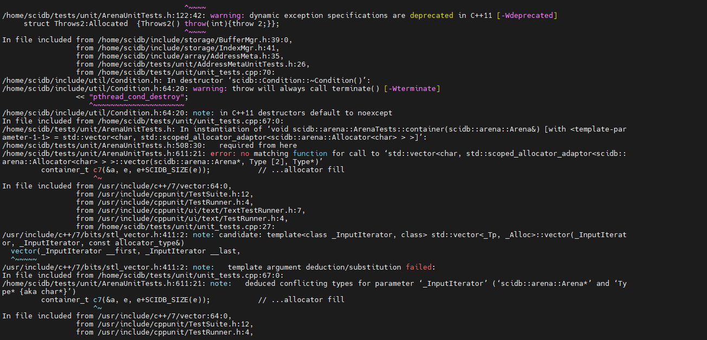

2022年1月12日10:03:28

#### 安装boost库

https://www.jb51.net/article/150380.htm

```
apt install libboost-all-dev
```


#### 安装libcsv3

```
apt install libcsv3
```


#### 安装liblog4cxx10v5

```
apt install liblog4cxx10v5
```


#### 安装postgrelsql

```bash
# focal上面默认安装v12，bionic上面默认安装v10
apt install postgresql
```

查询ubuntu上面的包，还可以指定ubuntu版本bionic https://packages.ubuntu.com/

https://packages.ubuntu.com/search?keywords=postgresql&searchon=names&suite=bionic&section=all

#### [Ubuntu通过apt-get安装指定版本和查询指定软件有多少个版本](https://www.cnblogs.com/EasonJim/p/7144017.html)


安装postgrelsql

https://linux.cn/article-11480-1.html

安装默认版本，1804的是pgsql10

```
sudo apt update
sudo apt install postgresql postgresql-contrib
```


如果想安装最新版，需要


```bash
# pgsql 的一些包
apt install libpqxx-6.4

# google protobuf(focal 只有17版本，需要的是libprotobuf9v5)
apt install libprotobuf17

# 安装失败，提示libgflags2v5无法安装
apt install librocksdb5

apt insatll librocksdb5.17

# 下面这个包已经安装了，应该是前面某个包顺带安装的
apt install libssl1.1

# OK
apt install python-crypto
```

#### intel包 inte-mkl-64bit缺失

https://www.intel.com/content/www/us/en/developer/articles/guide/installing-free-libraries-and-python-apt-repo.html

```bash
# 这个包没有，应该要在scidb提供的Intel那个源才能有这个包
apt install intel-mkl-64bit

# 先安装秘钥
cd /tmp
wget --no-check-certifcate https://apt.repos.intel.com/intel-gpg-keys/GPG-PUB-KEY-INTEL-SW-PRODUCTS-2019.PUB
apt-key add GPG-PUB-KEY-INTEL-SW-PRODUCTS-2019.PUB
rm GPG-PUB-KEY-INTEL-SW-PRODUCTS-2019.PUB

# 再安装repo: Intel® oneAPI Math Kernel Library (oneMKL):
sudo sh -c 'echo deb https://apt.repos.intel.com/mkl all main > /etc/apt/sources.list.d/intel-mkl.list'
apt update
```


2022-5-22 20:48:38

Ubuntu18.04 源码包安装

```bash
# 基础软件包
sudo apt-get install build-essential
```


##### 安装cmake

```bash
# 下面这种方式只能安装3.10版本的，版本太旧了
apt install cmake 
snap install cmake

# 安装最新版cmake
# 添加签名密钥
wget -O - https://apt.kitware.com/keys/kitware-archive-latest.asc 2>/dev/null | sudo apt-key add -
# 稳定版
sudo apt-add-repository 'deb https://apt.kitware.com/ubuntu/ bionic main'
# sudo apt-get update

# 候选发布版
# sudo apt-add-repository 'deb https://apt.kitware.com/ubuntu/ bionic-rc main'
# sudo apt-get update 


# 上面安装的稳定版cmake是最新版的3.23.1 太新了，clion调试目前只支持到3.22版本
# 手动安装cmake 3.22版本 2022年6月29日09:31:41
# cmake官网下载cmake安装的sh文件 
mkdir /usr/local/cmake
chmod +x cmake-3.22.5-linux-x86_64.sh
./cmake-3.22.5-linux-x86_64.sh --skip-license --exclude-subdir
# 这样就会在当前目录下面生成bin, doc, man, share等目录
# 然后需要手动软连接到/usr/bin目录下面，否则clion配置远程环境找不到cmake
ln -sf $(pwd)/bin/*  /usr/bin/
```

```bash
# 查看所有版本
apt-cache show cmake

# 查看指定环境变量
echo $CXX
echo $CC
echo $FC
```


##### 安装gfortran库

```bash
apt install gfortran
```


#### cmake依赖

**find_package(MPI)**


find_package(**LibRT** REQUIRED)

`Found LibRT: /usr/lib/x86_64-linux-gnu/librt.so`


find_package(**Boost** 1.54 REQUIRED)

```bash
CMake Error at /usr/share/cmake-3.23/Modules/FindPackageHandleStandardArgs.cmake:230 (message):
  Could NOT find Boost (missing: Boost_INCLUDE_DIR date_time filesystem
  program_options regex serialization system thread atomic) (Required is at
  least version "1.54")
Call Stack (most recent call first):
  /usr/share/cmake-3.23/Modules/FindPackageHandleStandardArgs.cmake:594 (_FPHSA_FAILURE_MESSAGE)
  /usr/share/cmake-3.23/Modules/FindBoost.cmake:2375 (find_package_handle_standard_args)
  CMakeLists.txt:256 (find_package)

# 安装boost
apt install libboost-all-dev  
```


find_package(**Protobuf** REQUIRED)

```bash
CMake Error at /usr/share/cmake-3.23/Modules/FindPackageHandleStandardArgs.cmake:230 (message):
  Could NOT find Protobuf (missing: Protobuf_LIBRARIES Protobuf_INCLUDE_DIR)
Call Stack (most recent call first):
  /usr/share/cmake-3.23/Modules/FindPackageHandleStandardArgs.cmake:594 (_FPHSA_FAILURE_MESSAGE)
  /usr/share/cmake-3.23/Modules/FindProtobuf.cmake:650 (FIND_PACKAGE_HANDLE_STANDARD_ARGS)
  CMakeLists.txt:266 (find_package)

# 查找
apt search libprotobuf
# 安装protobuf
apt install libprotobuf10
# 开发库 只用安装这个就可以了
apt install libprotobuf-dev 

-- Found Protobuf: /usr/lib/x86_64-linux-gnu/libprotobuf.so;-lpthread (found version "3.0.0")
```

上面这个只是安装了库，还需要安装proto的compiler

```bash
apt  install protobuf-compiler
```


find_package(**Log4CXX** REQUIRED)

```bash
sudo apt install liblog4cxx-dev
# 找到了
-- LOG4CXX - /usr/lib/x86_64-linux-gnu/liblog4cxx.so
```


find_package(**Doxygen**)

```
apt install doxygen
```


安装postgresql之后，任然没有下面两个库，还是需要自己安装

find_package(**LibPQXX** REQUIRED)

针对c++的库

```bash
apt show libpqxx # 没有结果
apt install libpqxx-6.4 # 找不到这个包
# 这个可以
sudo apt install libpqxx-dev
# 找到了
-- Found LibPQXX: /usr/lib
```


find_package(**LibPQ** REQUIRED)

针对c的库

```bash
apt install libpq-dev
# 找到了
-- Found LibPQ: /usr/bin/pg_config
-- Found LibPQ: /usr/lib/x86_64-linux-gnu
```


#### find_package(**OpenSSL** 0.9.8 REQUIRED)

https://www.jianshu.com/p/578dc82b06cc

```bash
CMake Error at /usr/share/cmake-3.23/Modules/FindPackageHandleStandardArgs.cmake:230 (message):
  Could NOT find OpenSSL, try to set the path to OpenSSL root folder in the
  system variable OPENSSL_ROOT_DIR (missing: OPENSSL_CRYPTO_LIBRARY
  OPENSSL_INCLUDE_DIR) (Required is at least version "0.9.8")
# 但是我的openssl命名已经是1.1.1版本了，上面还是报错
root@xy-virtual-machine:/home/scidb/build# openssl version
OpenSSL 1.1.0g  2 Nov 2017 (Library: OpenSSL 1.1.1  11 Sep 2018)
# 安装一下，就ok了，可能是没有那个ssl-dev的包导致的
apt install openssl libssl-dev -y

# 找到了
-- Found OpenSSL: /usr/lib/x86_64-linux-gnu/libcrypto.so (found suitable version "1.1.1", minimum required is "0.9.8")
```


**find_package(PkgConfig)**

```
-- Found PkgConfig: /usr/bin/pkg-config (found version "0.29.1")
```


find_package(**FLEX** 2.5.35 REQUIRED)

find_package(**BISON** 2.4 REQUIRED)

词法解析用的

https://blog.csdn.net/lishichengyan/article/details/79511161

```bash
CMake Error at /usr/share/cmake-3.23/Modules/FindPackageHandleStandardArgs.cmake:230 (message):
  Could NOT find FLEX (missing: FLEX_EXECUTABLE) (Required is at least
  version "2.5.35")

sudo apt-get install flex bison
# 输出
The following additional packages will be installed:
  libbison-dev libfl-dev libfl2 libsigsegv2 m4
Suggested packages:
  bison-doc flex-doc m4-doc
The following NEW packages will be installed:
  bison flex libbison-dev libfl-dev libfl2 libsigsegv2 m4
...  
```

> -- Found FLEX: /usr/bin/flex (found suitable version "2.6.4", minimum required is "2.5.35")
> -- Found BISON: /usr/bin/bison (found suitable version "3.0.4", minimum required is "2.4")


find_package(**SED** REQUIRED)

> -- Found SED: /bin/sed


find_package(**ZLIB** REQUIRED)

> -- Found ZLIB: /usr/lib/x86_64-linux-gnu/libz.so (found version "1.2.11")


find_package(**BZip2** REQUIRED)

> CMake Error at /usr/share/cmake-3.23/Modules/FindPackageHandleStandardArgs.cmake:230 (message):
>   Could NOT find BZip2 (missing: BZIP2_LIBRARIES BZIP2_INCLUDE_DIR)

```bash
sudo apt install libbz2-dev
```

>-- Found BZip2: /usr/lib/x86_64-linux-gnu/libbz2.so (found version "1.0.6")
>-- Looking for BZ2_bzCompressInit
>-- Looking for BZ2_bzCompressInit - found


find_package(**Threads** REQUIRED)

> 


find_package(**PythonInterp** REQUIRED)

> 


find_package(**EditLine** REQUIRED)

> -- Could NOT find Libedit (missing: LIBEDIT_LIBRARIES LIBEDIT_INCLUDE_DIR)

```bash
apt install libedit-dev
```

找到了

> -- Found Libedit: /usr/lib/x86_64-linux-gnu/libedit.so


**find_package(MKL_BLAS)**

没找到上面这个mkl_blas，则需要

find_package(**BLAS** REQUIRED)

find_package(**LAPACK** REQUIRED)


https://blog.csdn.net/qq_23927381/article/details/108899379

我们有时候要用到intel的mkl库，一般的方法是去官网上注册账号，然后下载，一步一步照着安装，最后还可能找不到mkl。再加上Ubuntu使用repo有点问题。这里提供一种非常快捷的方式直接安装最新版本的mkl。

首先下载gnupg并且设置keyring：

```bash
cd /tmp
wget https://apt.repos.intel.com/intel-gpg-keys/GPG-PUB-KEY-INTEL-SW-PRODUCTS-2019.PUB
apt-key add GPG-PUB-KEY-INTEL-SW-PRODUCTS-2019.PUB
```


然后直接使用apt来安装mkl2020.2：

```
sudo apt-get install intel-mkl-64bit-2020.2
```

最后source一下大功告成：todo 

```bash
source /opt/intel/compilers_and_libraries_2020/linux/mkl/bin/mklvars.sh intel64 ilp64
```


```bash
# 安装了好多包
The following NEW packages will be installed:
  intel-comp-l-all-vars-19.1.2-254 intel-comp-nomcu-vars-19.1.2-254 intel-conda-index-tool-19.1.2-254 intel-conda-intel-openmp-linux-64-shadow-package-19.1.2-254 intel-conda-mkl-devel-linux-64-shadow-package-2020.2-254
  intel-conda-mkl-include-linux-64-shadow-package-2020.2-254 intel-conda-mkl-linux-64-shadow-package-2020.2-254 intel-conda-mkl-static-linux-64-shadow-package-2020.2-254 intel-conda-tbb-linux-64-shadow-package-2020.3-254
  intel-mkl-64bit-2020.2-108 intel-mkl-cluster-2020.2-254 intel-mkl-cluster-c-2020.2-254 intel-mkl-cluster-f-2020.2-254 intel-mkl-cluster-rt-2020.2-254 intel-mkl-common-2020.2-254 intel-mkl-common-c-2020.2-254
  intel-mkl-common-c-ps-2020.2-254 intel-mkl-common-f-2020.2-254 intel-mkl-common-ps-2020.2-254 intel-mkl-core-2020.2-254 intel-mkl-core-c-2020.2-254 intel-mkl-core-f-2020.2-254 intel-mkl-core-ps-2020.2-254
  intel-mkl-core-rt-2020.2-254 intel-mkl-doc-2020 intel-mkl-doc-ps-2020 intel-mkl-f95-2020.2-254 intel-mkl-f95-common-2020.2-254 intel-mkl-gnu-2020.2-254 intel-mkl-gnu-c-2020.2-254 intel-mkl-gnu-f-2020.2-254
  intel-mkl-gnu-f-rt-2020.2-254 intel-mkl-gnu-rt-2020.2-254 intel-mkl-pgi-2020.2-254 intel-mkl-pgi-c-2020.2-254 intel-mkl-pgi-rt-2020.2-254 intel-mkl-psxe-2020.2-108 intel-mkl-tbb-2020.2-254 intel-mkl-tbb-rt-2020.2-254
  intel-openmp-19.1.2-254 intel-psxe-common-2020.2-108 intel-tbb-libs-2020.3-254 intel-tbb-libs-common-2020.3-254

```


> -- DEBUG MKL_BLAS_LIBRARY=/opt/intel/compilers_and_libraries/linux/mkl/lib/intel64/libmkl_rt.so
> -- Found MKL_BLAS


其他

cppunit

单元测试

```bash
sudo apt install libcppunit-dev
```

> -- Checking for module 'cppunit'
> --   Found cppunit, version 1.14.0


#### 安装libcsv3

```bash
apt install libcsv3 # 这个安装了没用
apt install libcsv-dev
```


openmpi

```bash
sudo apt-get install openmpi-bin openmpi-doc libopenmpi-dev
```


ScaLAPACK 

注意，这个包必须要，否则 src/mpi下面的cmake会报错：

> No SOURCES given to target: mpi


先搜索包

https://packages.ubuntu.com/search?keywords=ScaLAPACK+&searchon=names&suite=bionic&section=all

```bash
sudo apt install libscalapack-openmpi-dev 
```

找到了：

> -- Debug: SCALAPACK_LIBRARIES is /usr/lib/x86_64-linux-gnu/libscalapack-openmpi.so


rocksdb 必须的包

```bash
apt install librocksdb-dev
# 输出
The following additional packages will be installed:
  libgflags2.2 librocksdb5.8 libsnappy1v5 # 这个依赖librocksdb5.8
The following NEW packages will be installed:
  libgflags2.2 librocksdb-dev librocksdb5.8 libsnappy1v5
```


### 报错

#### 第三方库  extern/MurmurHash报错

error: this statement may fall through 

原因：将警告当成错误处理

make CFLAGS='-Wno-implicit-fallthrough'

或者编辑 makefile文件，修改cflags，去掉-Werror


#### 缺少scidb_msg.pb.h文件

```bash
/home/scidb/src/system/Resources.cpp:33:10: fatal error: network/proto/scidb_msg.pb.h: No such file or directory
 #include <network/proto/scidb_msg.pb.h>
```

msg传输使用了protobuf，需要先生成相应的头文件才可以

```bash
# protoc -I=$SRC_DIR --cpp_out=$DST_DIR /path/to/file./home/scidb/src/network/proto/
cd /home/scidb/src/network/proto/
protoc  --cpp_out=./ ./scidb_msg.proto # 生成了scidb_msg.pb.cc 和 scidb_msg.pb.h
# cmake 使用 protobuf_generate_cpp生成的命令
protoc --cpp_out /home/scidb/build/src/network/proto -I /home/scidb/src/network/proto /home/scidb/src/network/proto/scidb_msg.proto 

```


### 错误：target pattern contains no %

```bash
src/network/proto/CMakeFiles/scidb_msg_lib.dir/build.make:73: *** target pattern contains no '%'.  Stop.
CMakeFiles/Makefile2:2005: recipe for target 'src/network/proto/CMakeFiles/scidb_msg_lib.dir/all' failed
make[1]: *** [src/network/proto/CMakeFiles/scidb_msg_lib.dir/all] Error 2

# 打开build.make这个文件
src/network/proto/scidb_msg.pb.h: ../src/network/proto/scidb_msg.proto
src/network/proto/scidb_msg.pb.h: src/network/proto/protobuf::protoc # dz 上面报错的，就是这一行
	@$(CMAKE_COMMAND) -E cmake_echo_color --switch=$(COLOR) --blue --bold --progress-dir=/home/scidb/build/CMakeFiles --progress-num=$(CMAKE_PROGRESS_1) "Running cpp protocol buffer compiler on scidb_msg.proto"
	cd /home/scidb/build/src/network/proto && protobuf::protoc --cpp_out /home/scidb/build/src/network/proto -I /home/scidb/src/network/proto /home/scidb/src/network/proto/scidb_msg.proto
```

https://github.com/Ultimaker/libArcus/issues/108

上面这个链接和我的问题一模一样，解决方式：指定一个protoc的绝对路径！！！

```bash
cmake -DPROTOBUF_PROTOC_EXECUTABLE=/usr/bin/protoc ../
```


### 错误：error: ‘random_device’ does not name a type;

```bash
/home/scidb/src/network/Authenticator.cpp: In member function ‘scidb::Authenticator::Cookie scidb::Authenticator::makeCookie()’:
/home/scidb/src/network/Authenticator.cpp:140:25: error: ‘random_device’ does not name a type; did you mean ‘random_data’?
     static thread_local random_device r;
                         ^~~~~~~~~~~~~
                         random_data
/home/scidb/src/network/Authenticator.cpp:141:15: error: ‘r’ was not declared in this scope
     _cookie = r();
```

```c++
// 代码
Authenticator::Cookie Authenticator::makeCookie()
{
    static thread_local random_device r; // random_device就是一个类
    _cookie = r(); // dz 产生一个随机数用作cookie
    return _cookie;
}
```

解决办法：在Authenticator.cpp文件中，加一个头文件就可以了。不知道这个是什么问题导致的，scidb官方应该不会犯这种错误。

```c++
#include <random>
```


### 错误：MessageHandler does not name a type

```
/home/scidb/src/network/NetworkManager.cpp:1636:24: error: ‘MessageHandler’ in ‘class scidb::NetworkMessageFactory’ does not name a type
 NetworkMessageFactory::MessageHandler
                        ^~~~~~~~~~~~~~
src/network/CMakeFiles/network_lib.dir/build.make:89: recipe for target 'src/network/CMakeFiles/network_lib.dir/NetworkManager.cpp.o' failed
```

```c++
# MessageHandler这么定义的
typedef std::function< void(const std::shared_ptr<MessageDescription>& ) > MessageHandler;
```

最前面还有个错误，感觉这个是主要原因

> ‘function’ in namespace ‘std’ does not name a template type

```c++
// 在 NetworkMessageFactory.h中添加下面的include就ok了
#include <functional>
```


### 错误：undefined reference to `typeinfo for rocksdb::Comparator'

链接的时候报的错

https://blog.csdn.net/ai2000ai/article/details/47152133

> ###### 混用了no-RTTI代码和RTTI代码
>
> 我碰到的正是混用了no-RTTI和RTTI代码的情形。项目中我们自己写的程序必须开启RTTI，而我们使用的外部的一个库使用no-RTTI编译。我们在自己的代码中需要重载一个外部库中的带虚函数的类，结果链接的时候就出现了问题。外部库中的基类使用-fno-rtti选项编译，生成的代码没有typeinfo信息，而我们的代码使用-frtti选项编译，要求基类必须要有typeinfo信息。最后，我在编译系统中做了一些dirty hack，让那个派生类所在的源文件以-fno-rtti选项编译，解决了问题。

https://www.cnblogs.com/zhchy89/p/10730711.html

> 最近的项目（so库）用到rocksdb，之前用的rocksdb是4.3.0，编译使用很正常。因为要升级，所以将rocksdb升级到5.13.0。
>
> 但是经过修改的项目，编译链接后，ldd -r xx.so 总是会出现 undefine symbol: _ZNVTrocksdb6Logger等之类的错误。
>
> 原来，新版的rocksdb引入了USE_RTTI选项，可以对需函数的typeinfo进行开关，于是加上“USE_RTTI=1”重新编译rocksdb。
>
> 再在自己的项目编译时也加上-frtti。终于，ldd没有出现undefine symbol错误。


> ## 编译方式
>
> **注意**：如果你打算在生产环境中使用 RocksDB，请不要使用 `make` 或者是 `make all` 的方式进行编译。因为这两种方式会编译出 debug 模式的 RocksDB，性能要差很多。
>
> RocksDB 正常是可以在不安装任何依赖的情况下编译的，但是我们推荐安装一些压缩库（见下文）。当然，新版本的 gcc/clang 还是需要的，因为使用到了 C++11 的特性。
>
> 以下是一些编译 RocksDB 的选择：
>
> - 【推荐】`make static_lib` 将会编译出一个 RocksDB 的静态库 librocksdb.a。这个静态库是 release 模式的。
> - `make shared_lib` 将会编译出一个 RocksDB 的动态库 librocksdb.so。这个动态库是 release 模式的。
> - `make check` 将会编译并运行所有的单元测试，得到的 RocksDB 是 debug 模式的。
> - `make all` 将会编译出一个静态库、所有的工具和单元测试。我们的工具依赖 gflags，所以在运行 `make all` 之前必须先安装 gflags。这种方式得到的 RocksDB 是 debug 模式的，不要在生产环境中使用 `make all` 编译出来的二进制包。
> - 默认情况下，我们编译的二进制包会针对你编译所在的平台进行优化（`-march=native` 或相同的东西），如果你的 CPU 支持 SSE4.2 指令集的话也会自动开启。当使用 `USE_SSE=1 make static_lib` 或者 `cmake -DFORCE_SSE42=ON` 去编译，且 CPU 还不支持 SSE4.2 指令集的话，就会显示一条警告信息。如果你想要一个便捷式的二进制包，就在 make 命令前添加 `PORTABLE=1`，比如说 `PORTABLE=1 make static_lib`。


```bash
# 下载rocksdb5.7版本
# 生成动态库
make shared_lib

# 编译ok之后复制头文件到include目录，todo 应该有更好的办法，make install等，待研究
cp -r include/* /usr/include
cp librocksdb.so /usr/lib
cp librocksdb.so.5 /usr/lib
cp librocksdb.so.5.7 /usr/lib
cp librocksdb.so.5.7.5 /usr/lib # 这个是真的文件，其他几个是软连接
```


### 错误：(make进度到89%了)

```bash
/usr/include/c++/7/bits/uses_allocator.h:90:7: error: static assertion failed: construction with an allocator must be possible if uses_allocator                   is true
       static_assert(__or_<
       ^~~~~~~~~~~~~
tests/unit/CMakeFiles/unit_tests.dir/build.make:75: recipe for target 'tests/unit/CMakeFiles/unit_tests.dir/unit_tests.cpp.o' failed

```



不知道上面是什么错误，只能先把test这个 目录屏蔽掉，不构建test了


2022-5-25 15:02:03 终于build成功了！！！

注意，默认构建的版本是 ASSERT的build_type.

```bash
make install
-------------------
Install the project...
-- Install configuration: "Assert"
-- Installing: /usr/local/include/array
-- Installing: /usr/local/include/array/TransientCache.h
-- Installing: /usr/local/include/array/SharedBuffer.h
... # include头文件
-- Installing: /usr/local/include/network
-- Installing: /usr/local/include/network/NetworkMessage.h
-- Installing: /usr/local/include/network/Network.h
... # lib库
-- Installing: /usr/local/lib/libblas.so.3
-- Installing: /usr/local/lib/liblapack.so.3
... # bin文件
-- Installing: /usr/local/bin/scidb
... # local lib
-- Installing: /usr/local/lib/scidb/plugins/libpoint.so
-- Installing: /usr/local/lib/scidb/plugins/librational.so
-- Installing: /usr/local/lib/scidb/plugins/libcomplex.so
-- Installing: /usr/local/lib/scidb/plugins/libra_decl.so
...
```


#### SciDB源码编译 DEBUG版本-2022年6月29日10:08:18

目录在 /scidb/build下面

```shell
cmake -D CMAKE_BUILD_TYPE=debug ..
---------------------------------------------------------------------------------------------
root@xy-virtual-machine:/scidb/build# cmake -D CMAKE_BUILD_TYPE=debug ..
-- The C compiler identification is GNU 7.5.0
-- The CXX compiler identification is GNU 7.5.0
-- The Fortran compiler identification is GNU 7.5.0
-- Detecting C compiler ABI info
-- Detecting C compiler ABI info - done
-- Check for working C compiler: /usr/bin/gcc-7 - skipped
-- Detecting C compile features
-- Detecting C compile features - done
-- Detecting CXX compiler ABI info
-- Detecting CXX compiler ABI info - done
-- Check for working CXX compiler: /usr/bin/g++-7 - skipped
-- Detecting CXX compile features
-- Detecting CXX compile features - done
-- Detecting Fortran compiler ABI info
-- Detecting Fortran compiler ABI info - done
-- Check for working Fortran compiler: /usr/bin/gfortran-7 - skipped
-- Performing Test SCIDB_CXX_HAS_FLAG
-- Performing Test SCIDB_CXX_HAS_FLAG - Success
-- Performing Test SCIDB_CXX_HAS_FLAG
-- Performing Test SCIDB_CXX_HAS_FLAG - Success
-- Performing Test SCIDB_CXX_HAS_FLAG
-- Performing Test SCIDB_CXX_HAS_FLAG - Success
-- Performing Test SCIDB_CXX_HAS_FLAG
-- Performing Test SCIDB_CXX_HAS_FLAG - Success
-- CLIKE_LANGUAGE_WARNINGS =  -Wall -Wextra -pedantic -Wconversion -Wno-strict-aliasing -Wno-unused-parameter -Wno-variadic-macros -Wno-error=unused-result -Wno-error=vla -Wno-error=sign-compare -Wno-error=sized-deallocation -Wno-error=deprecated-declarations
-- Build type: debug
-- Found Git: /usr/bin/git (found version "2.17.1")
-- SCIDB_VERSION_MAJOR : 19
-- SCIDB_VERSION_MINOR : 11
-- SCIDB_VERSION_PATCH : 5
-- SCIDB_BUILD_REVISION: f8334b6
-- SCIDB_SHORT_VERSION : 19.11
-- SCIDB_VERSION_MMP   : 19.11.5
-- SCIDB_VERSION       : 19.11.5.f8334b6
-- CMAKE_INSTALL_PREFIX Initialized to default setting to: /opt/scidb/19.11
-- Could NOT find MPI_C (missing: MPI_C_LIB_NAMES MPI_C_HEADER_DIR MPI_C_WORKS)
-- Could NOT find MPI_CXX (missing: MPI_CXX_LIB_NAMES MPI_CXX_HEADER_DIR MPI_CXX_WORKS)
-- Could NOT find MPI_Fortran (missing: MPI_Fortran_LIB_NAMES MPI_Fortran_F77_HEADER_DIR MPI_Fortran_MODULE_DIR MPI_Fortran_WORKS)
-- Could NOT find MPI (missing: MPI_C_FOUND MPI_CXX_FOUND MPI_Fortran_FOUND)
-- Found MPI_C: /usr/lib/x86_64-linux-gnu/openmpi/lib/libmpi.so (found version "3.1")
-- Found MPI_CXX: /usr/lib/x86_64-linux-gnu/openmpi/lib/libmpi_cxx.so (found version "3.1")
-- Found MPI_Fortran: /usr/lib/x86_64-linux-gnu/openmpi/lib/libmpi_usempif08.so (found version "3.1")
-- Found MPI: TRUE (found version "3.1")
--  ------- MPI_INST_DIR = /usr ---
--  ------- MPI_FLAVOR = openmpi ---
-- Found LibRT: /usr/lib/x86_64-linux-gnu/librt.so
-- Looking for pthread.h
-- Looking for pthread.h - found
-- Performing Test CMAKE_HAVE_LIBC_PTHREAD
-- Performing Test CMAKE_HAVE_LIBC_PTHREAD - Failed
-- Looking for pthread_create in pthreads
-- Looking for pthread_create in pthreads - not found
-- Looking for pthread_create in pthread
-- Looking for pthread_create in pthread - found
-- Found Threads: TRUE
-- Found Boost: /usr/include (found suitable version "1.65.1", minimum required is "1.54") found components: date_time filesystem program_options regex serialization system thread atomic chrono
-- Found Protobuf: /usr/lib/x86_64-linux-gnu/libprotobuf.so;-lpthread (found version "3.0.0")
-- Found Log4CXX: /usr/lib/x86_64-linux-gnu/liblog4cxx.so
-- LOG4CXX - /usr/lib/x86_64-linux-gnu/liblog4cxx.so
-- Found Doxygen: /usr/bin/doxygen (found version "1.8.13") found components: doxygen missing components: dot
-- Found LibPQXX: /usr/lib
-- Found LibPQ: /usr/bin/pg_config
-- Found LibPQ: /usr/lib/x86_64-linux-gnu
-- Found OpenSSL: /usr/lib/x86_64-linux-gnu/libcrypto.so (found suitable version "1.1.1", minimum required is "0.9.8")
-- Found PkgConfig: /usr/bin/pkg-config (found version "0.29.1")
-- Checking for module 'cppunit'
--   Found cppunit, version 1.14.0
-- Found FLEX: /usr/bin/flex (found suitable version "2.6.4", minimum required is "2.5.35")
-- Found BISON: /usr/bin/bison (found suitable version "3.0.4", minimum required is "2.4")
-- Found SED: /bin/sed
-- Found ZLIB: /usr/lib/x86_64-linux-gnu/libz.so (found version "1.2.11")
-- Found BZip2: /usr/lib/x86_64-linux-gnu/libbz2.so (found version "1.0.6")
-- Looking for BZ2_bzCompressInit
-- Looking for BZ2_bzCompressInit - found
-- Found PythonInterp: /usr/bin/python (found version "2.7.17")
-- Found Libedit: /usr/lib/x86_64-linux-gnu/libedit.so
-- DEBUG MKL_BLAS_LIBRARY=/opt/intel/compilers_and_libraries/linux/mkl/lib/intel64/libmkl_rt.so
-- Found MKL_BLAS
-- Configuring /scidb/src/system/Constants.cpp.in as /scidb/build/src/system/Constants.cpp
-- *****BEGIN src/mkl/CMakeLists.txt *******************************
DEBUG,adding overriding softlinks from platform blas and lapack to mkl
-- creating symlink from /scidb/build/softlinks/libblas.so.3 to /opt/intel/compilers_and_libraries/linux/mkl/lib/intel64/libmkl_rt.so
-- creating symlink from /scidb/build/softlinks/liblapack.so.3 to /opt/intel/compilers_and_libraries/linux/mkl/lib/intel64/libmkl_rt.so
-- ***** END src/mkl/CMakeLists.txt *******************************
-- ****************** BEGIN src/mpi/CMakeLists.txt ******************
-- Found SCALAPACK: /usr/lib/x86_64-linux-gnu/libscalapack-openmpi.so
-- Debug: SCALAPACK_LIBRARIES is /usr/lib/x86_64-linux-gnu/libscalapack-openmpi.so
-- Debug: SCALAPACK_INC_DIR is
-- Debug: Building MPI Slave
-- ****************** BEGIN mpi/slaving/CMakeLists.txt ******************
-- Debug:src/mpi/slaving BLAS_LIBRARIES  is /opt/intel/compilers_and_libraries/linux/mkl/lib/intel64/libmkl_rt.so
-- Debug:src/mpi/slaving LAPACK_LIBRARIES is /opt/intel/compilers_and_libraries/linux/mkl/lib/intel64/libmkl_rt.so
-- Debug:src/mpi/slaving SCALAPACK_LIBRARIES is /usr/lib/x86_64-linux-gnu/libscalapack-openmpi.so
-- Debug:src/mpi/slaving MPI_LIBRARIES is /usr/lib/x86_64-linux-gnu/openmpi/lib/libmpi_cxx.so;/usr/lib/x86_64-linux-gnu/openmpi/lib/libmpi.so
-- ****************** END mpi/slaving/CMakeLists.txt ******************
-- ****************** END src/mpi/CMakeLists.txt ******************
-- *****BEGIN dense_linear_algebra/CMakeLists.txt ***********************
-- MPI_Fortran_COMPILER=/usr/bin/mpif90.openmpi
-- Debug: MPI_Fortran_COMPILER is /usr/bin/mpif90.openmpi
-- *****END linear_algebra/CMakeLists.txt ***********************
-- **BEGIN linear_algebra/CMakeLists.txt --------------------------------
-- **END linear_algebra/CMakeLists.txt --------------------------------
-- ****************** BEGIN src/storage/CMakeLists.txt ******************
-- ****************** END src/storage/CMakeLists.txt ******************
-- copying /scidb/tests to /scidb/build/tests
-- install.cmake: copying library redirection links from /scidb/build/softlinks to lib
-- ****************** END CMakeLists.txt ******************
-- Configuring done
-- Generating done
-- Build files have been written to: /scidb/build
```


```bash
make
make install
-----------------
debug版本的 make install 最后都安装到opt的scidb目录下面了，和上面assert版本不同！！！
Installing: /opt/scidb/19.11/bin
```


#### DEBUG编译过程遇到的问题

##### protobuf头文件缺失，和上面一样

```
/scidb/src/system/Resources.cpp:33:10: fatal error: network/proto/scidb_msg.pb.h: No such file or directory
 #include <network/proto/scidb_msg.pb.h>
```

解决：

```
protoc --cpp_out /scidb/build/src/network/proto -I /scidb/src/network/proto /scidb/src/network/proto/scidb_msg.proto 
```

