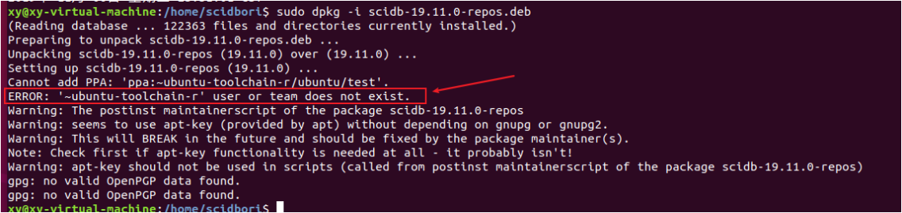
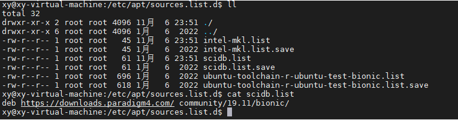
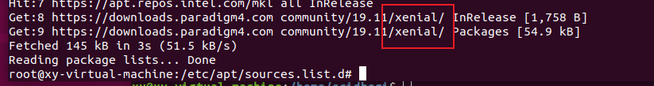

# 安装SciDB19.11


## 下载源码

https://downloads.paradigm4.com/community/19.11/


## 解压

-C 解压到指定目录

```
tar -zxf scidb-19.11.5.f8334b60.tgz -C ./scidb/
```

需要非root用户登录安装才可以

Linux EUID，SUID，RUID简单理解 https://blog.csdn.net/hbhgyu/article/details/80571786

查看一个包安装到了哪里 

```bash
dpkg -L openssh-client
```

报错：ERROR: '~ubuntu-toolchain-r' user or team does not exist. 



手动安装ppa源试试： https://launchpad.net/~ubuntu-toolchain-r

```
sudo add-apt-repository ppa:ubuntu-toolchain-r/test
sudo apt-get update
```


绕过代理试试

https://blog.csdn.net/qq_42148563/article/details/120757603

```
sudo -E add-apt-repository --update ppa:ubuntu-toolchain-r/test
```


添加PPA源之后，可以去下面这个目录查看源信息

```
cd /etc/apt/sources.list.d
```




### Ubuntu 各版本号和名称对照

https://blog.csdn.net/songfulu/article/details/85310273

```
14.04 LTS	Trusty Tahr
15.04	    Vivid Vervet
16.04 LTS	Xenial Xerus
18.04 LTS	Bionic Beaver
20.04 LTS   Focal Fossa
```

因为目前是18.04的ubuntu系统，所以之前scidb.list里面的deb源写的是bionic, 但是paradigm4的网站里面19.11只支持trusty和xenial，所以apt-get update更新的时候，会提示scidb这个无法访问，手动将scidb.list改成xenial之后update就ok了 !



