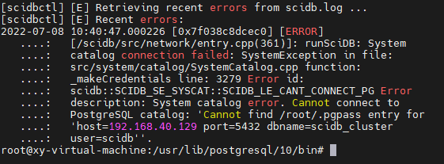
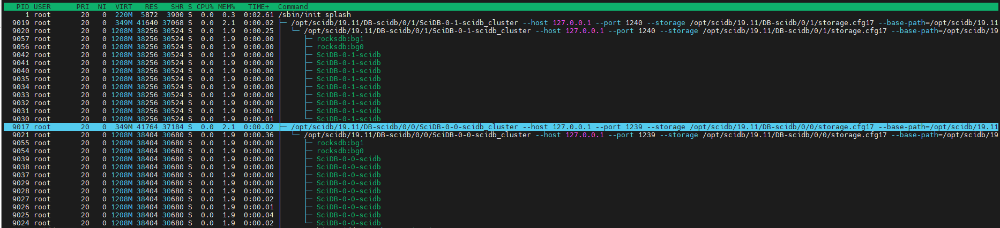
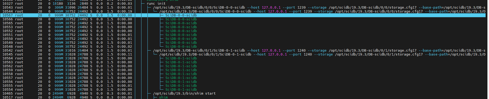

## 虚拟机容器运行scidb

```bash
# 查看用户
cat /etc/passwd
# 当前登录用户
root@xy-virtual-machine:~# who
xy       :0           2022-06-22 10:02 (:0)
root     pts/0        2022-06-22 10:58 (192.168.80.1)
root     pts/1        2022-06-22 14:39 (192.168.80.1)

# 查看用户组
cat /etc/group
# 清晰显示用户，不会显示 nologin, halt, shutdown等用户
cat /etc/passwd|grep -v nologin|grep -v halt|grep -v shutdown|awk -F":" '{ print $1"|"$3"|"$4 }'|more

# 判断是否存在用户
id -u postgres
103
id -u scidb
id: scidb: no such user
```


#### PG常用命令

教程：https://www.postgresqltutorial.com/

```bash
# 连接数据库, 默认的用户postgres和数据库postgres
psql -U user -d dbname
psql -U postgres -d postgres
# 或者, 先切换到postgres用户
su username
#或者 sudo -i -u postgres
psql

# 退出psql
\q
```


数据库相关

```bash
# 查看所有数据库
select * from pg_database;
# 列举数据库，相当于mysql的show databases
\l

# 切换数据库，相当于mysql的use dbname
\connect DBNAME
# 或者
\c DBNAME
------------------------------------------------------------
postgres=# \c scidb;
You are now connected to database "scidb" as user "postgres".
scidb=#

# 创建数据库： 
create database dbname; 
# 删除数据库： 
drop database dbname;  
```

表相关

```bash
# 列举表，相当于mysql的show tables
\dt

# 查看表结构，相当于desc tblname,show columns from tbname
\d tblname

# 查看索引 
\di
```


其他

```bash
# 显示 PostgreSQL 的使用和发行条款
\copyright
# 显示或设定用户端字元编码
\encoding [字元编码名称]
# SQL 命令语法上的说明，用 * 显示全部命令，比如 \h select就可以查看select的语法说明
\h [名称] 
# 提示用户设定内部变数
\prompt [文本] 名称
# 改密码                  
\password [USERNAME]

psql 数据库名  --连接数据库
select rolname,rolpassword from pg_authid;--查看用户名密码
select usename,passwd from pg_shadow;--查看用户名密码
select version();	-- 查看版本
select current_database();--查看当前数据库
\l					--查看所有数据库
\dt					--查看表
\password username	--修改密码
\password           --设置密码。
\?                  --查看psql命令列表。
\c [database_name]  --连接其他数据库，切换数据库。
\conninfo           --列出当前数据库和连接的信息。
\d                  --列出当前数据库的所有表格。
\d [table_name]     --列出某一张表格的结构。
\du                 --列出所有用户。
\e                  --打开文本编辑器。
help				--帮助
\h                  --查看SQL命令的解释，比如\h select。
\q					--退出
```


备份

```bash
# 可以使用pg_dump和pg_dumpall来完成，比如备份sales数据库： 
pg_dump drupal>/opt/Postgresql/backup/1.bak  TODO，好像不太行
```

pg_dump说明：http://postgres.cn/docs/9.6/app-pgdump.html


#### 修改pgsql配置文件：

```bash
# 配置文件位置，这个文件配置客户端校验 PostgreSQL Client Authentication Configuration File
/etc/postgresql/9.3/main/pg_hba.conf
/etc/postgresql/10/main/pg_hba.conf
#-------------配置--------------
# 前面两个host的是已经存在的，后面一个需要自己根据CIDR配置
host all all 127.0.0.1/32 md5
host all all ::1/128 md5
host all all W.X.Y.Z/N md5

# 有集群后添加
host    all             all             192.168.40.0/24         md5
#------------------------------

# 在运行的系统上修改这个文件之后，需要操作才能生效
pg_ctl reload
# pg_ctl这个命令提示找不到

# 总的配置文件
/etc/postgresql/9.3/main/postgresql.conf
# 最后添加
listen_addresses='*'
# 重启pgsql
sudo /etc/init.d/postgresql restart
```


### SciDB表

```bash
scidb-# select * from array; # 直接查询scidb中的array表，会报错，不知道为什么
ERROR:  syntax error at or near "l"
LINE 1: l

scidb=# select * from public.array; # 需要加上schema才可以，但是默认的schema不就是public么？
 id |        name         | flags | distribution_id
----+---------------------+-------+-----------------
  1 | dz_random_numbers   |     0 |               1
  2 | dz_random_numbers@1 |     0 |               1
(2 rows)
```


```bash
-----------------------------------------------------
scidb=# \dt
                  List of relations
 Schema |            Name            | Type  | Owner
--------+----------------------------+-------+-------
 public | array                      | table | scidb
 public | array_attribute            | table | scidb
 public | array_dimension            | table | scidb
 public | array_distribution         | table | scidb
 public | array_residency            | table | scidb
 public | array_version              | table | scidb
 public | array_version_lock         | table | scidb
 public | cluster                    | table | scidb
 public | instance                   | table | scidb
 public | latest_array_version       | table | scidb
 public | libraries                  | table | scidb
 public | membership                 | table | scidb
 public | namespace_members          | table | scidb
 public | namespaces                 | table | scidb
 public | role_members               | table | scidb
 public | role_namespace_permissions | table | scidb
 public | roles                      | table | scidb
 public | users                      | table | scidb
(18 rows)
-----------------------------------------------------

-----------------------------------------------------
scidb=# \d instance
                   Table "public.instance"
       Column       |            Type             | Modifiers
--------------------+-----------------------------+-----------
 instance_id        | bigint                      | not null
 membership_id      | bigint                      | default 0
 host               | character varying           |
 port               | integer                     |
 online_since       | timestamp without time zone |
 base_path          | character varying           |
 server_id          | integer                     |
 server_instance_id | integer                     |
Indexes:
    "instance_pkey" PRIMARY KEY, btree (instance_id)
    "instance_host_port_key" UNIQUE CONSTRAINT, btree (host, port)
    "instance_host_server_id_server_instance_id_key" UNIQUE CONSTRAINT, btree (host, server_id, server_instance_id)
    "instance_server_id_server_instance_id_key" UNIQUE CONSTRAINT, btree (server_id, server_instance_id)
Check constraints:
    "instance_base_path_non_unique" CHECK (check_base_path(base_path))
    "instance_server_id_host_unique" CHECK (check_server_id_host(server_id, host))
Referenced by:
    TABLE "array_residency" CONSTRAINT "array_residency_instance_id_fkey" FOREIGN KEY (instance_id) REFERENCES instance(instance_id)
    TABLE "array_version_lock" CONSTRAINT "array_version_lock_coordinator_id_fkey" FOREIGN KEY (coordinator_id) REFERENCES instance(instance_id)
    TABLE "array_version_lock" CONSTRAINT "array_version_lock_instance_id_fkey" FOREIGN KEY (instance_id) REFERENCES instance(instance_id)
-----------------------------------------------------
```


**users表目前只有一个用户 scidbadmin**

```bash
scidb=# select * from users;
 id |    name    | method |                                         password                                         | salt
----+------------+--------+------------------------------------------------------------------------------------------+------
  1 | scidbadmin | raw    | eUCUk3B57IVO9ZfJB6CIEHl/0lxrWg/7PV8KytUNY6kPLhTX2db48GHGHoizKyH+uGkCfNTYZrJgKzjWOhjuvg== |
(1 row)
```

**roles表也只有一个角色acidbadmin**

```bash
scidb=# select * from roles;
 id |    name
----+------------
  1 | scidbadmin
(1 row)
```

**角色-用户 关系**

```bash
scidb=# select * from role_members;
 role_id | user_id
---------+---------
       1 |       1
(1 row)
```


docker启动scidb时的提示：

```bash
docker run -it --name="scidb" fb5b /bin/bash
-----------------------------------------------------------------------
 * Starting OpenBSD Secure Shell server sshd                    [ OK ]
 * Starting PostgreSQL 9.3 database server                      [ OK ]
shim: SciDB HTTP service started on port(s) 8080,8083s with web root [/var/lib/shim/wwwroot], talking to SciDB on port 1239
[scidbctl] Starting SciDB cluster scidb ...
[scidbctl-0-0-scidb] Starting s0-i0 on server 127.0.0.1
[scidbctl-0-1-scidb] Starting s0-i1 on server 127.0.0.1
[scidbctl] Started 2 instances, waiting up to 30 seconds for cluster sync
[scidbctl] Cluster is ready
```

有一个集群：

```bash
scidb=# select * from cluster;
             cluster_uuid             | metadata_version
--------------------------------------+------------------
 f9d016e8-520c-11ea-b480-0242ac110003 |                5
```

有两个实例：

```bash
scidb=# select * from instance;
 instance_id | membership_id |   host    | port |       online_since        |        base_path         | server_id | server_instance_id
-------------+---------------+-----------+------+---------------------------+--------------------------+-----------+--------------------
           0 |             0 | 127.0.0.1 | 1239 | 2020-02-18 05:10:27.32034 | /opt/scidb/19.3/DB-scidb |         0 |                  0
           1 |             0 | 127.0.0.1 | 1240 | 2020-02-18 05:10:27.67094 | /opt/scidb/19.3/DB-scidb |         0 |                  1
(2 rows)

```


#### 配置文件

```bash
# 位置
# ini文件分号是注释，注意要另起一行才行，不支持行间注释
/opt/scidb/19.3/etc/config.ini 
#---------------------------------------
[scidb]
# base path下面的0代表server0，server0下面的0,1代表instance0和1
base-path=/opt/scidb/19.3/DB-scidb
base-port=1239
db_user=scidb
install_root=/opt/scidb/19.3
# 19.3里面默认的日志级别是warn，改成debug试试
logconf=/opt/scidb/19.3/share/scidb/log4cxx.properties
# 里面放了很多其他的so文件
pluginsdir= /opt/scidb/19.3/lib/scidb/plugins
# server-id=IP, number of worker instances
server-0=127.0.0.1,1
execution-threads=4
result-prefetch-threads=3
result-prefetch-queue-size=1
operator-threads=1
sg-send-queue-size=4
sg-receive-queue-size=4
#---------------------------------------
```


scidb的docker容器中，root用户目录下面，有一个 .pgpass文件，内容是

> 127.0.0.1:5432:scidb:scidb:Y2FhZTBiNjU5NDk5NzFkNzg5ZjNhZDNh


启动scidb

```bash
# /opt/scidb/19.3/bin/scidbctl.py start <CLUSTER_NAME>
/opt/scidb/19.3/bin/scidbctl.py start
--------------------------------------------------------------------------
[scidbctl] Starting SciDB cluster scidb ... # 注意，这里启动的就是集群scidb,也就是config.ini最上面的[scidb]
[scidbctl-0-0-scidb] Starting s0-i0 on server 127.0.0.1
[scidbctl-0-1-scidb] Starting s0-i1 on server 127.0.0.1
[scidbctl] Started 2 instances, waiting up to 30 seconds for cluster sync
[scidbctl] Cluster is ready
--------------------------------------------------------------------------
```

确认scidb在运行：

```bash
iquery -aq "list('instances')"
--------------------------------------------------------------------------
root@9a5ae7fc5a66:~# iquery -aq "list('instances')"
{No} name,port,instance_id,online_since,instance_path
{0} '127.0.0.1',1239,0,'2020-02-18 05:10:27','/opt/scidb/19.3/DB-scidb/0/0'
{1} '127.0.0.1',1240,1,'2020-02-18 05:10:28','/opt/scidb/19.3/DB-scidb/0/1'
--------------------------------------------------------------------------
```

停止scidb

```bash
root@9a5ae7fc5a66:/opt/scidb/19.3/bin# ./scidbctl.py stop
[127.0.0.1] Stopping local scidb instances
[scidbctl] Waiting up to 10 seconds for cluster scidb to stop...
[scidbctl] Cluster scidb stopped
```

检查服务是否在各个服务器上面运行

```bash
scidbctl.py --config <config.ini> status <CLUSTER_NAME>
/opt/scidb/19.11/bin/scidbctl.py status
--------------------------------------------------------------------------
root@9a5ae7fc5a66:/opt/scidb/19.3/bin# scidbctl.py --config /opt/scidb/19.3/etc/config.ini status scidb
PID     PPID    CMD             SERVER
836     834     SciDB-0-0-scidb 127.0.0.1
835     832     SciDB-0-1-scidb 127.0.0.1
--------------------------------------------------------------------------
```

日志文件

```bash
# 目录
/opt/scidb/19.3/DB-scidb/0/0
```


```bash
docker inspec scidb_容器id
------------------------------------
env环境变量：
"PATH=/usr/local/sbin:/usr/local/bin:/usr/sbin:/usr/bin:/sbin:/bin:/opt/scidb/19.3/bin",
"SCIDB_VER=19.3",
"SCIDB_NAME=scidb",
"SCIDB_INSTALL_PATH=/opt/scidb/19.3"

```


### SciDB-SQL语句

```bash
# 首先插入了一张表
iquery -aq "store(build(<num:double>[x=0:8,1,0, y=0:9,1,0], random()),dz_random_numbers)"
# 查询该表结构
SELECT * FROM show(dz_random_numbers); 
iquery -aq "SELECT * FROM show(dz_random_numbers)" # 报语法错误
--------------------------------------------------------------------
root@9a5ae7fc5a66:/opt/scidb/19.3/bin# iquery
AQL% SELECT * FROM show(dz_random_numbers);
{i} schema,distribution
{0} 'dz_random_numbers<num:double> [x=0:8:0:1; y=0:9:0:1]','hashed'
--------------------------------------------------------------------

# 在AQL中可以直接查询该表
AQL% select * from dz_random_numbers;
```


### SciDB代码流程

entry: runSciDB开始运行，第一个日志 221行：Start SciDB instance


日志中查找用这个 runSciDB: preloading injecterror

**NetworkManager::run() 之后**

Creating ClientCommManager on port 5239

Creating CcmConnection

Network manager is started on 127.0.0.1:1239 instance #s0-i0 (0)

之后会在消息类型上面搞一个订阅者 

Subscribe [scidb::InstanceLiveness] (id = 1) # 这段代码在 notification.h 207行


之后开始接收 startAccept(); 这里就会初始化 newConnection，去连接对端。 这个startAccept会调用一个异步接收的，会接收请求，请求在 handleAccept里面处理，处理之后，又会调用 startAccept继续接收请求，形成了一个不断接收请求的循环。


之后就是io_service的main loop

LOG4CXX_DEBUG(logger, "Start connection accepting and async message exchanging");

    // main loop
    _ioService.run();


readmessage调用流程：

networkmanager.startAccept() 里面会构造一个newConnection

```c++
// todo 不知道为什么这个connection只用了三个参数，connection需要4个参数的，还差一个对方的instance_id
std::shared_ptr<Connection> newConnection =
           std::make_shared<Connection>(*this, getNextConnGenId(), _selfInstanceID);
```


NetworkManager::handleAccept -> newConnection->start() 然后 startAccept -> startAccept里面 又会循环调用 _acceptor.async_accept（回调函数是handleAccept，形成一个循环了），所以突破点是上面的 conn->start()，这个函数里面会读取socket里面的数据，之后就是下面readmessage的流程了：

```c++
_networkManager.getIOService().post(std::bind(&Connection::readMessage,shared_from_this()));
```

readMessage -> asio::async_read -> 异步读到了数据 handleReadMessage，这个里面会读取header中的getRecordSize() 获取头结点数据大小 -> handleReadRecordPart 里面会看 是否binary_size>0, 大于0就读取binary_size大小的数据 -> 之后会调用NetworkManger:handleMessage -> 然后分发消息NetworkManager::dispatchMessage start -> 我这个消息是 有Conn但是没有session的，表示现在还在验证和登录，所以会 发一个job AuthMessageHandleJob-> 处理这个job,会调用他的dispatch 方法，根据消息类型 switch，现在消息类型是 mtAuthLogon -> AuthMessageHandleJob::handleAuthLogon()


connecttion中有session，session中可以知道是否来自于client


#### BaseConnection:

sendAndReadMessage: 是个**同步**的消息发送和接受的函数

receive函数是直接使用的 read函数读取的，没有用boost的一些函数，有点奇怪： 不对，下面read只有两个参数？TODO 这个应该也是boost的函数，因为里面的socket也是 boost::asio::ip::tcp::socket _socket;

```
// 函数原型   Ssize_t read(int fd,void *buf,size_t nbyte)
size_t readBytes = read(_socket, boost::asio::buffer(&resultDesc->_messageHeader,
                                                             sizeof(resultDesc->_messageHeader)));
```


#### Connection：

这个是用于NetworkManager之间一部消息的传递使用的，继承自 baseconnection.


## scidb源码编译安装之后运行

~~make install 之后，目前安装在 /usr/local/bin里面，和docker里面的/opt/scidb/19.3/bin里面的内容是一样的~~

debug版本 make install之后也会把这些东西弄到 /opt/scidb/19.11/bin里面，不知道是因为和assert不同，还是上次assert版本编译后安装有问题。


直接运行，会没有配置文件

```bash
# /opt/scidb/19.11/bin/scidbctl.py start <CLUSTER_NAME> 我只有一个cluster，可以不用指定
# /opt/scidb/19.3/bin/scidbctl.py start
/opt/scidb/19.11/bin/scidbctl.py start
/opt/scidb/19.11/bin/scidbctl.py stop
[scidbctl] [E] Missing config file /usr/local/etc/config.ini
```


```bash
mkdir /opt/scidb/19.11/etc
cd /opt/scidb/19.11/etc
vi config.ini
#-------------19.11配置文件--------------
[scidb_cluster]
base-path=/opt/scidb/19.11/DB-scidb
base-port=1239
db_user=scidb
pg-port=5432
install_root=/opt/scidb/19.11
logconf=/opt/scidb/19.11/share/scidb/log4cxx.properties
pluginsdir= /opt/scidb/19.11/lib/scidb/plugins
server-0=192.168.40.129,1
server-1=192.168.40.130,1
execution-threads=4
result-prefetch-threads=3
result-prefetch-queue-size=1
operator-threads=1
sg-send-queue-size=4
sg-receive-queue-size=4

#------------1.添加用户------------------
# http://data.digitser.net/ubuntu/zh-CN/useradd.html
# -c 注释 -m 创建用户主目录 -G 新帐户补充组列表 -s 登录shell -U 创建与用户同名的组
# useradd -c "scidb administrator" -m -G admin -s /bin/bash -U scidb
# 添加失败，上面提示 admin组不存在
# 查看有哪些组,发现没有admin组，有很多组，包括root, adm, sudo等
vi /etc/group
# 先添加到sudo组吧
useradd -c "scidb administrator" -m -G sudo -s /bin/bash -U scidb

#------------2.添加目录------------------
mkdir /opt/scidb/19.11/DB-scidb
# https://blog.csdn.net/qq_34447388/article/details/90754535
#chown -R scidb /opt/scidb/19.11/DB-scidb 只变了用户，文件夹的组还是root
#chown -R scidb:scidb /opt/scidb/19.11/DB-scidb
chown -R scidb:scidb /opt/scidb
chown -R scidb:scidb /home/scidb

mkdir -p /opt/scidb/19.11/DB-scidb/0/0
mkdir -p /opt/scidb/19.11/DB-scidb/0/1
```


##### 添加pgpass文件： ~<SCIDB_USER>/.pgpass

.pgpass 是 连接 postgresql 时使用的密码文件，通常位置为 ~/.pgpass。

~/.pgpass 上的权限必须不允许所有人或组内访问，可以用命令chmod 0600 ~/.pgpass 实现。如果权限没有这么严格，该文件将被忽略。

```bash
vi /root/.pgpass
# <COORDINATOR>:<PG_PORT>:<CLUSTER_NAME>:<DB_USER>:<DB_PASSWORD>
# 其实格式为：hostname:port:database:username:password 只不过scidb帮我们创建了scidb_cluster的数据库了
# 本地单server如下：
#127.0.0.1:5432:scidb_cluster:scidb:Y2FhZTBiNjU5NDk5NzFkNzg5ZjNhZDNh
# 127.0.0.1:5432:scidb_cluster:scidb:123456
192.168.40.129:5432:scidb_cluster:scidb:123456 # 变成集群之后用这个

# 设置权限!!! 注意，不能设置为777！！！
chmod 0600 ~/.pgpass

# postgres查看所有用户
\du
# 创建用户
```


更改数据库postgres用户密码：

```
ALTER USER postgres WITH PASSWORD 'postgres';
ALTER USER scidb WITH PASSWORD '123456';
```

更改linux中postgres用户密码：

```bash
# 删除用户postgres的密码
sudo passwd -d postgres
# 添加密码，需要输入两次密码确认，我设置的是 'postgres'
sudo -u postgres passwd

# linux scidb用户我设置了 123456的密码
sudo passwd -d scidb
sudo -u scidb passwd
```


添加权限，让linux postgres用户有权限访问scidb用户的目录

```bash
BASE_PATH=/opt/scidb/19.11/DB-scidb # e.g. /home/scidb/base_path
SCIDB_USER=scidb # e.g. scidb
# user_group 我是 1001
USER_GROUP=$(id -g ${SCIDB_USER} )
# 下面这个我输出的是 /home/scidb
USER_HOME=$(eval echo "~${SCIDB_USER}")

# sudo usermod -G ${USER_GROUP} -a postgres
sudo usermod -G 1001 -a postgres

# sudo chmod g+rx ${USER_HOME}
sudo chmod g+rx /home/scidb

# sudo mkdir -p ${BASE_PATH}
# sudo chown ${SCIDB_USER}:${USER_GROUP} ${BASE_PATH} # 这个之前已经执行过了
# sudo chmod g+rx ${BASE_PATH}
sudo chmod g+rx /opt/scidb/19.11/DB-scidb
```


```bash
# 初始化系统目录
sudo -u postgres /opt/scidb/19.11/bin/scidbctl.py init-syscat scidb_cluster
# 要求输入两次密码，我都输入了postgres，也不知道对不对，然后就创建了scidb的pg用户，同时创建了scidb_cluster数据库
# 但是数据库中没有找到表，感觉创建失败了

# 初始化数据库， pgpass文件ok，这个就成功了，之前一直不成功，成功之后，数据库中的表就创建了！
# 创建集群之后，执行这个命令需要 pg_hba文件中可以远程访问，因为config.ini中server设置的不再是本地ip了，pg默认只能local访问
/opt/scidb/19.11/bin/scidbctl.py --config /opt/scidb/19.11/etc/config.ini init-cluster scidb_cluster
```

创建集群后，重新执行这个初始化数据库的操作，报错了，root中已经有pgpass文件了，而且也改成了 192.168.40.129:xxx的形势了。



解决： 将这个文件复制到 /home/scidb里面，重新执行就ok了。

注意：集群修改了server数量之后，要执行这个文件才行，要不然会提示没有找到systemcatlog啥的。这个重新执行后，集群就可以起来了。


```bash
# 查看状态，比docker里面的多了好多，docker里面只有2个，同时我发现集群worker的scidb可以被master关闭
/opt/scidb/19.11/bin/scidbctl.py status
---------------------------------------------
PID     PPID    CMD             SERVER
8334    6659    SciDB-0-0-scidb 127.0.0.1 # 这个的父进程6659是 /bin/bash 
8337    8334    SciDB-0-0-scidb 127.0.0.1 # 这个是上面那个衍生出来的，父进程是上面那个
9021    9017    SciDB-0-0-scidb_cluster 127.0.0.1
8335    6659    SciDB-0-1-scidb 127.0.0.1
8336    8335    SciDB-0-1-scidb 127.0.0.1
9020    9019    SciDB-0-1-scidb_cluster 127.0.0.1

# 上面8334 命令是/opt/scidb/19.3/DB-scidb/0/0/SciDB-0-0-scidb --host 127.0.0.1 --port 1239 --storage /opt/scidb/19.3/DB-scidb/0
# 是19.3，感觉是docker里面的也混在这个里面了。。。
# 8337：/opt/scidb/19.3/DB-scidb/0/0/SciDB-0-0-scidb --host 127.0.0.1 --port 1239 --storage /opt/scidb/19.3/DB-scidb/0
# 9021：/opt/scidb/19.11/DB-scidb/0/0/SciDB-0-0-scidb_cluster --host 127.0.0.1 --port 1239 --storage /opt/scidb/19.11/
# 这个9021才是我自己启动的scidb！

# 所以关闭dokcer再看看, 这次就只有2个剩下了
docker stop 9a5a
/opt/scidb/19.11/bin/scidbctl.py status
----------------------------------------
PID     PPID    CMD             SERVER
9021    9017    SciDB-0-0-scidb_cluster 127.0.0.1
9020    9019    SciDB-0-1-scidb_cluster 127.0.0.1

# 9017的启动命令，就是把所有的参数都放在命令行中了
/opt/scidb/19.11/DB-scidb/0/0/SciDB-0-0-scidb_cluster --host 127.0.0.1 --port 1239 --storage /opt/scidb/19.11/DB-scidb/0/0/storage.cfg17 --base-path=/opt/scidb/19.11/DB-scidb --base-port=1239 --db-user=scidb --install-root=/opt/scidb/19.11 --logconf=/opt/scidb/19.11/share/scidb/log4cxx.properties --pluginsdir=/opt/scidb/19.11/lib/scidb/plugins --execution-threads=4 --result-prefetch-threads=3 --result-prefetch-queue-size=1 --operator-threads=1 --sg-send-queue-size=4 --sg-receive-queue-size=4 --db-host=127.0.0.1 --pg-host=127.0.0.1 --pg-port=5432 --pg-user=postgres --ssh-port=22 --pgpassfile=/root/.pgpass --catalog=host=127.0.0.1 port=5432 dbname=scidb_cluster user=scidb
```


```bash
# 安装htop查看线程信息
apt-get install htop
htop # F2进入设置，在左侧第二项display options中勾选 show tree 和 show custom thread name即可。
```



~~可以看到上面一个instance启动了好些个线程(9个)，另外还包括2个rocksdb线程。~~  9个是之前的，后面我自己创建了一个rdma的service，就是10个线程了。

把docker启动之后，看docker中的scidb，也是9个线程，同时19.3好像还没用rocksdb




```bash
# ps -T -p <pid> 这种方式也能查看进程下面的线程
# ps -T -p 9017
ps -T -p 9021
------------------------------------------
root@xy-virtual-machine:~# ps -T -p 9021
   PID   SPID TTY          TIME CMD
  9021   9021 pts/0    00:00:00 SciDB-0-0-scidb
  9021   9024 pts/0    00:00:00 SciDB-0-0-scidb
  9021   9025 pts/0    00:00:00 SciDB-0-0-scidb
  9021   9026 pts/0    00:00:00 SciDB-0-0-scidb
  9021   9027 pts/0    00:00:00 SciDB-0-0-scidb
  9021   9028 pts/0    00:00:00 SciDB-0-0-scidb
  9021   9029 pts/0    00:00:00 SciDB-0-0-scidb
  9021   9037 pts/0    00:00:00 SciDB-0-0-scidb
  9021   9038 pts/0    00:00:00 SciDB-0-0-scidb
  9021   9039 pts/0    00:00:00 SciDB-0-0-scidb
  9021   9054 pts/0    00:00:00 rocksdb:bg0
  9021   9055 pts/0    00:00:00 rocksdb:bg1

```


### SciDB编译

###### 只编译network_lib库

```bash
cd /scidb/build
# 这个是个static库, 注意，之前添加了一些文件，make的时候这个一直没有啥变化，一下就构建完成了，后面才发现是因为cmake文件中没有将新添加的文件加入src依赖中。。。
make network_lib
```


###### 重新编译可执行文件

```bash
# entry中添加了代码，executalbe可执行文件scidb依赖了 entry.cpp
make scidb
# 最后报了一个error, 但是好像还是编译成功了：error: scidb(.debug_info) is too large (0xaa23f1c bytes) 算了一下，大概178MB
```


/opt/scidb/19.11/bin/scidbctl.py start

/opt/scidb/19.11/bin/scidbctl.py stop


#### 添加ssh key实现节点间免密

```bash
# 新建秘钥
ssh-keygen

# ssh-copy-id - 将你的公共密钥填充到一个远程机器上的authorized_keys文件中。
# ssh-copy-id [-i [identity_file]] [user@]machine
ssh-copy-id -i ~/.ssh/id_rsa.pub <SCIDB_USER>@localhost
ssh-copy-id -i ~/.ssh/id_rsa.pub <SCIDB_USER>@0.0.0.0
ssh-copy-id -i ~/.ssh/id_rsa.pub <SCIDB_USER>@127.0.0.1

# 这个也是使用ssh登录，需要输入对端的密码
# 129 master
ssh-copy-id -i ~/.ssh/id_rsa.pub root@192.168.40.130
ssh-copy-id -i ~/.ssh/id_rsa.pub scidb@127.0.0.1 
# 没有成功，密码是对的，123456，提示没有权限创建.ssh文件夹，手动创建后提示没有权限创建auth_key什么的，后面发现应该是因为我 /home/scidb这个目录之前放了 scidb源代码，属主是 xy用户，不属于scidb用户，重新赋予这个目录给scidb，然后先切换到scidb用户，ssh-keygen生成scidb用户自己的ssh目录和秘钥，再做上面的操作，就ok了。
chown scidb:scidb /home/scidb
su scidb
ssh-keygen

# 130 worker
ssh-copy-id -i ~/.ssh/id_rsa.pub root@192.168.40.129
ssh-copy-id -i ~/.ssh/id_rsa.pub scidb@127.0.0.1

# 现在就可以使用ssh免密登录了
ssh 192.168.40.130

# 免密之后直接传输文件，集群环境下，一台机器编译之后直接将编译的结果传输到worker节点
scp /opt/scidb/19.11/lib/libscidbclient.so 192.168.40.130:/opt/scidb/19.11/lib/libscidbclient.so
scp /opt/scidb/19.11/lib/scidb/plugins/mpi_slave_scidb 192.168.40.130:/opt/scidb/19.11/lib/scidb/plugins/mpi_slave_scidb
scp /opt/scidb/19.11/lib/scidb/plugins/libmisc.so 192.168.40.130:/opt/scidb/19.11/lib/scidb/plugins/libmisc.so
scp /opt/scidb/19.11/bin/iquery 192.168.40.130:/opt/scidb/19.11/bin/iquery
scp /opt/scidb/19.11/bin/scidb 192.168.40.130:/opt/scidb/19.11/bin/scidb
```
